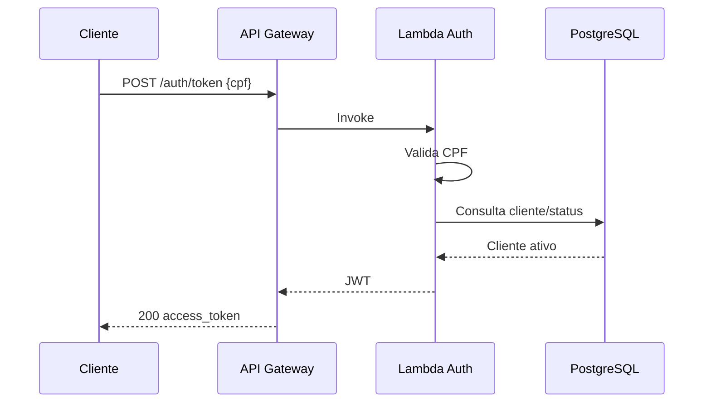

# Oficina Auth Serverless

Function serverless responsável pela autenticação de clientes por CPF. Valida o CPF, consulta o cliente no PostgreSQL e emite JWT para consumo das APIs protegidas.

## Stack
Python 3.13, AWS Lambda, API Gateway HTTP API, PostgreSQL/psycopg, PyJWT e Terraform.

## Fluxo


## Testes
```bash
python -m venv .venv && source .venv/bin/activate
pip install -r requirements-dev.txt
pytest -q
```

## Deploy
Crie os secrets `AWS_ACCESS_KEY_ID`, `AWS_SECRET_ACCESS_KEY`, `DATABASE_URL`, `JWT_SECRET` e a variável `AWS_REGION` no GitHub. Push em `hml` executa homologação; merge via PR em `main` executa produção.

## Endpoint
Após o `terraform apply`, use o output `auth_url`.
