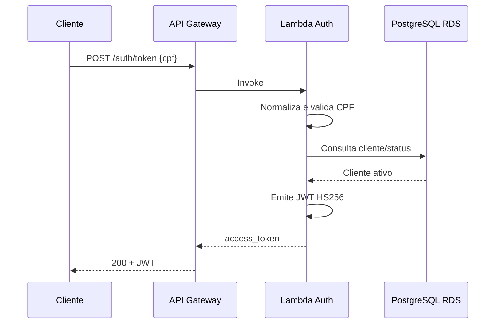

# Oficina Auth Serverless

Função serverless responsável pela autenticação de clientes por CPF. A Lambda valida o documento, consulta o cliente no PostgreSQL gerenciado e emite um JWT utilizado pelas rotas protegidas da Oficina.

## Stack

Python 3.13, AWS Lambda, Amazon API Gateway HTTP API, PostgreSQL/psycopg, PyJWT, AWS Secrets Manager e Terraform.

## Arquitetura específica



Quando a aplicação no EKS já está publicada, o mesmo API Gateway configura uma integração HTTP default para o Load Balancer da aplicação. As rotas `/api/*` continuam protegidas pela validação do JWT dentro da FastAPI.

## Testes locais

```bash
python -m venv .venv
source .venv/bin/activate
pip install -r requirements-dev.txt
pytest -q
```

## Deploy

O pipeline executa testes, empacota a Lambda, valida o Terraform e faz deploy controlado por `ENABLE_DEPLOY=true`.

Variáveis compartilhadas utilizadas pelo pipeline:

- `AWS_REGION=us-east-1`
- `TF_STATE_BUCKET=<bucket criado pelo bootstrap>`
- `TF_STATE_READY=true`
- `ENABLE_DEPLOY=true` somente quando o ambiente estiver pronto para deploy

Secrets GitHub:

- `AWS_ACCESS_KEY_ID`
- `AWS_SECRET_ACCESS_KEY`

A URL do banco é lida automaticamente do Secrets Manager (`oficina/<env>/database`). O segredo JWT é criado e persistido pelo próprio Terraform em `oficina/<env>/jwt`.

## Endpoint

Após o deploy, o Summary do GitHub Actions exibe `AUTH_URL` e `API_GATEWAY_URL`.

## Swagger / Postman

A documentação Swagger pertence à aplicação principal e fica disponível em `<API_GATEWAY_URL>/docs` após a integração com o backend.

Coleção Postman: https://github.com/YasminLuna/oficina-api/blob/hml/postman/Oficina-Fase3.postman_collection.json
